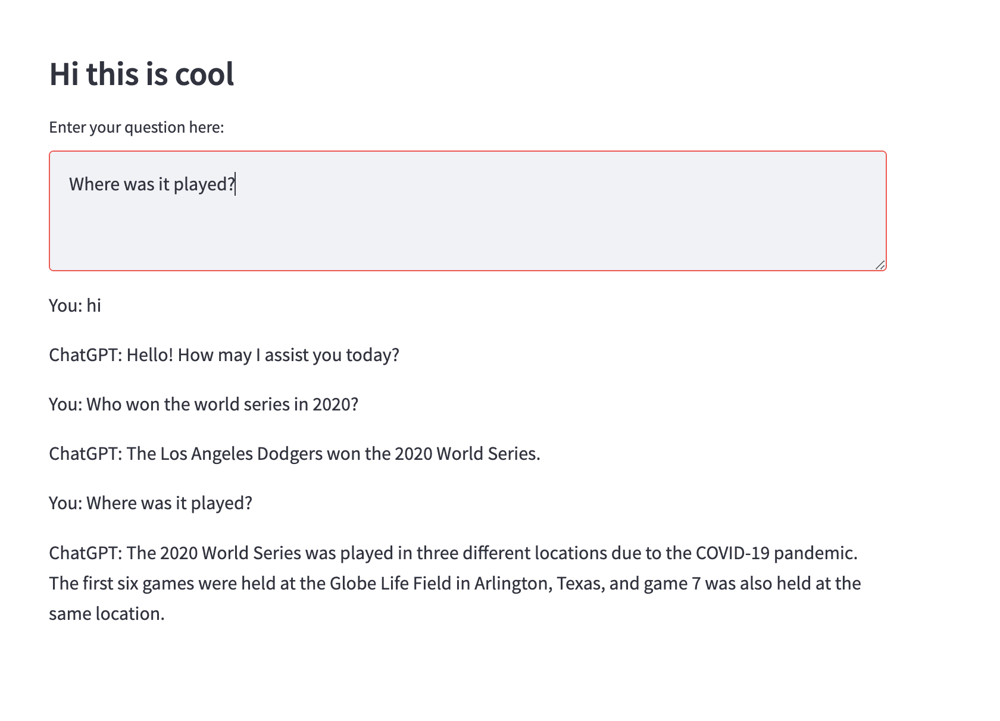

# Assignment: 
Commandline chatbot, take to web with streamlit, make it interesting

# Description: 
A chatbot using OpenAI API. Use streamlit and streamlit-chat for UI. 
Add a profanity filter. 

# How to run: 
python3 -m streamlit run main.py 

Demonstration: 

# What's helpful: 
ChatGPT Plus is helpful for getting started but can yield random code  
Official docs for OpenAI API, Streamlit, and Streamlit community is helpful for debugging 
